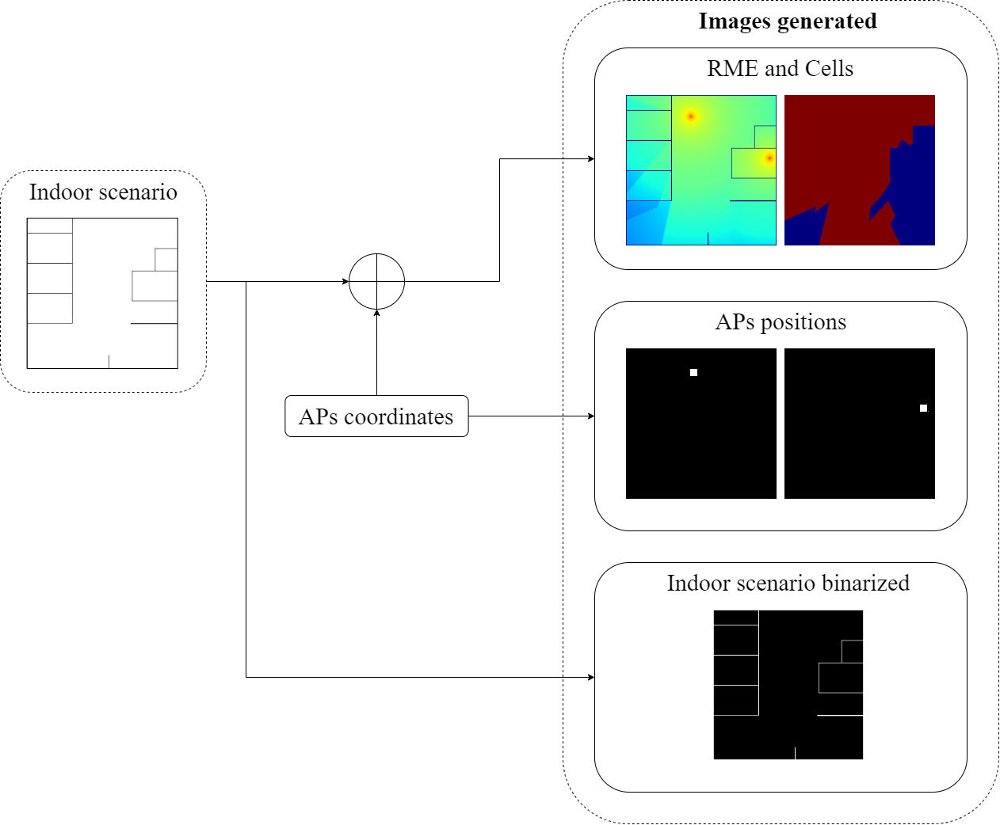

# Radio Indoor Propagation Software
We introducing a software implemented in [Matlab](www.mathworks.com/products/matlab.html "Matlab"), which use the [IEEE 802.11ax channel model](mentor.ieee.org/802.11/dcn/14/11-14-0882-04-00ax-tgax-channel-model-document.docx "IEEE 802.11ax channel model") to the calculation of Radio Maps Estimation (RME) and Cells Maps Estimation (CME) for indoor WLANs. This tool processes RGB or grayscale plans, where the walls are represented by black pixels, while the open spaces are depicted by white pixels. With a simple modification in the code, you can customize the file paths to read or save the desired data.

Aditionaly, the software require to read a APs postions's set. These ones can be to loaded like matrix or the code could be modified to generate these one here.

Is available the code to generate the random postions APs's set, too.Is important know that these ones are generated according the plan expected size.

The next image show process to calculate RME and CME:



## Cite as
```
@software{andres_j_florez_gonzalez_2023_8012406,
  author       = {Andres J. Florez-Gonzalez. and
                  Carlos A. Viteri-Mera.},
  title        = {Radio Indoor Propagation Software},
  month        = may,
  year         = 2023,
  publisher    = {Zenodo},
  version      = {V1.0},
  doi          = {10.5281/zenodo.8012406},
  url          = {https://doi.org/10.5281/zenodo.8012406}
}
```
